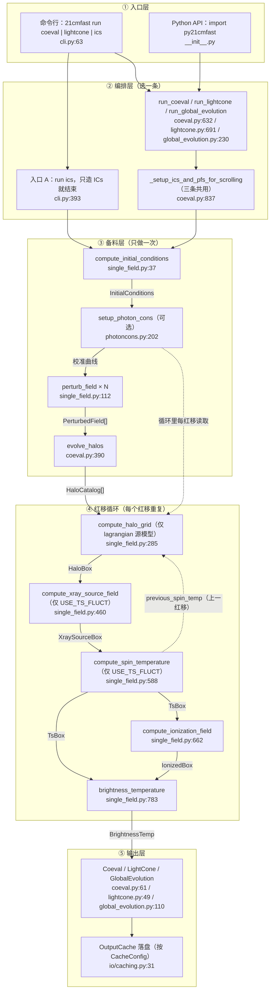

# 模块流程图（figures/）

把 21cmFAST 的**主模块流程**对象化画出来：方框 = 模块，箭头上青色标签 = 在节点间流动的产物，
箭头方向 = 调用/依赖。

组织方式是**总览 + 剖分**：**图1** 是主调度链总览（五层、每个模块一格）；**图2、图3** 把图1 里的
某几个方框再往下剖一层（同一个模块内部的步骤、分支与代码位置）。旁支末节不画。

生成脚本：`gen_module_flow.py`（纯 matplotlib，无额外依赖）。每张图同时给出 **SVG（矢量，放文档）**
与 **PNG（位图，贴聊天/邮件）**。

四条读图约定：**方框最后一行 = 该模块的代码位置**（`文件:行`，行号仅作定位提示、会随代码变动）；
**产物只写名字、不带 P 编号**——P 编号是 atlas 的横切索引（[../INDEX.md](../INDEX.md)）；
**箭头只画调度顺序上的那一条**，同一方框的其余输入写在方框内（红移循环里五步都吃 `微扰场[iz]`，链上只见一条）。**方框首行是标题**：加粗 + 放大 15%，其余行是正文；标题默认不动大小写（脚本里 `TITLE_UPPER = True` 可切全大写，但那会把 `compute_halo_grid` 写成 `COMPUTE_HALO_GRID`，与源码标识符不符，故默认关）。

**画布上不写图例说明**：线型、读法等约定一律放本节，画布上只放模块、产物与代码位置——
图上出现"某某线 = 某某义"这类句子，等于把图注塞进内容区。

| 文件 | 回答什么问题 |
| :--- | :--- |
| `fig1-module-flow` | **主调度链长什么样**：从入口到输出，五个层次（入口 → 编排 → 备料 → 红移循环 → 输出）各由谁负责，数据在中间怎么流动 |
| `fig2-top-drivers` | **剖分①：三个顶层驱动**——把图1 ② 编排层的三个方框拆开：各自的薄壳与私有前段（红移表怎么定、断点续算、lightconer 校验、单格参数改装…），三者在哪里汇入同一份备料与同一个循环，出口又怎么分道 |
| `fig3-ics-prep` | **剖分②：备料函数 `_setup_ics_and_pfs_for_scrolling`**——把图1 ③ 的第一格拆开：八步（算或跳过 ICs → 两级裁内存 → 可选校准 → 前置检查 → 微扰场 → 晕目录 → 返回四件套）+ 一处 `raise` 支路 |
| `fig4-code-structure` | **代码文件结构**（两版面）：上半=主干五层横带，层内文件横排＋真实调用箭头；下半=主干×功能库 **DSM 协同矩阵**（行=层、列=库组，有色格=存在依赖，零交叉线） |
| | 本目录另有**三张归档图**：三条流水线对照、`SOURCE_MODEL` 歧路、`PHOTON_CONS_TYPE` 歧路。它们不在默认出图集合里、产物在 `legacy/`；需要时显式生成（见文末「重新生成」） |

## 怎么读图1（主调度链）

看图顺序就是执行顺序，自上而下五层：

1. **入口层** —— 命令行 `21cmfast`（`setup.py:98` 注册 → `cli.py:app`）与 Python API（`__init__.py` 的 `__all__`）。
2. **编排层** —— 两个入口，**区别只在"跑到哪里停"**：**入口 A** `21cmfast run ics`（`cli.py:393`）**只造 ICs 就结束**——
   缓存里已有就打印提示直接 `return`（`:418-428`），没有才调 `compute_initial_conditions`（`:430`）并落盘；
   它是"把备料层第一步单独拎出来跑"的侧门，**不进备料层其余步骤、也不进红移循环**（用途：预计算一次，
   后续 E1/E2/E3 复用同一套随机实现）。**入口 B** 是三个顶层驱动、跑完整流水线；后者汇入
   `_setup_ics_and_pfs_for_scrolling`（**三条流水线共用同一份备料实现**）。
3. **备料层（只做一次）** —— `compute_initial_conditions` →（可选）`setup_photon_cons` → `perturb_field`（×红移数）
   → `evolve_halos`。产物名（`InitialConditions` / `校准曲线` / `PerturbedField[]` / `HaloCatalog[]`）标在箭头上。
4. **红移循环（每红移重复）** —— 这一带是**入口框 + 两排同网格**。入口框是每轮的入口：
   `this_perturbed_field = perturbed_field[iz]` + `load_all()`（`coeval.py:736-737`），离散晕时再加
   `this_halofield = halofield_list[iz]`（`:741-742`）；三条跨层入参（`微扰场[iz]` / `晕目录[iz]` / 校准曲线）
   **都落在它上面**——它们不属于任何一个具体步骤，**该框宽度正是这三条箭头落点所需要的最小跨度**（不是铺满整带）。
   两排按 **①→⑥** 编号（**编号即执行顺序**），每排三格共用同一列网格、两侧留边：
   第一排 **①** `compute_halo_grid`（`:743`，仅 lagrangian）→ **②** `compute_xray_source_field`（`:756`，仅 USE_TS_FLUCT **且** lagrangian）
   → **③** `compute_spin_temperature`（`:763`，仅 USE_TS_FLUCT）；
   第二排 **④** `compute_ionization_field`（`:776`，**无条件**）→ **⑤** `brightness_temperature`（`:788`，**无条件**）
   → **⑥** `Coeval` 装配与收尾——**图上只留概要**，细节以这里为准：`:800` 装配 7 样（ICs / 微扰场 / `IonizedBox` /
   `BrightnessTemp` / `TsBox` / `HaloBox` / 校准数据）、`:815` purge 上一轮微扰场、`:822` `HaloBox` 备下次快照、
   `:827-831` 仅在 `node_redshifts` 上推进 `prev_coeval` 与 `hbox_arr`、`:834` `yield`。
   位置行一律是「调用点 → 定义处」（如 `coeval.py:743 → single_field.py:285`），**调用点行号本身也编码了顺序**。
   ① 在 ④ 之前不是排版巧合——`compute_ionization_field(halobox=this_halobox, …)`（`:782`）直接吃 ① 的产物；
   两者可跳过性也不同：① 只在 lagrangian 源模型下跑，④ 无条件跑（`halobox` 可能是 `None`）。
   **HaloBox 不是"每轮一定通过"**：形参每轮都传（`:782`），但 `this_halobox` 每轮先重置为 `None`（`:714`），
   只有 `lagrangian_source_grid` 为真（`SOURCE_MODEL ∈ {L-INTEGRAL, DEXM-ESF, CHMF-SAMPLER}`）时才被
   `compute_halo_grid` 赋值（`:739`）；`E-INTEGRAL` / `CONST-ION-EFF` 下电离只吃微扰场。
   C 端所有 `halos->` 访问都由 `lagrangian_source_grids` 守卫（`IonisationBox.c:1409`、`:1475`），传 `None` 是合法路径。
   对应到图上：**①②③ 三个条件步骤画虚线框、与它们相连的四条箭头同为虚线；下排 ④⑤⑥ 必执行步骤为实线**，
   循环带下方另有一行线型规则可对照；`TsBox` 同理（非 `USE_TS_FLUCT` 时为 `None`）。

5. **输出层** —— 逐个红移装配成 `Coeval` / `LightCone` / `GlobalEvolution`，再由 `OutputCache` 按 `CacheConfig` 分类落盘。

图里刻意保留的两处"例外"，因为它们会直接影响行为：`setup_photon_cons` 必须在 `perturb_field` **之前**；
`XraySourceBox` 算完立刻 `purge(force=True)`（不等缓存兜底）。

## 怎么读图2（剖分①：三个顶层驱动）

**每一行 = 一个驱动，自左向右就是它的执行顺序**（框内编号是该驱动自己的序号）。绿色格「备料」、橙色格「红移循环」是**三条行共用的同一份实现**——图里在每行各画一份并标「（三条共用）」，比画一个竖框更容易看出顺序。
**要点：私有步骤并非「全在共用之前」** —— E1 的断点续算在备料**之后**（`:598`）、yield 过滤在循环**之后**（`:624`）；E2 建 `LightCone` 也在备料之后（`lightcone.py:430`）；E3 备料前有三步、备料后没有中段。
**三个真差异**：

| 差异 | E1 `run_coeval` | E2 `run_lightcone` | E3 `run_global_evolution` |
| :--- | :--- | :--- | :--- |
| 是不是薄壳 | 是：抽干生成器 + 按 `out_redshifts` 过滤（`coeval.py:639`） | 是：`deque(...)[0][-1]` 取最后一个（`lightcone.py:698`） | **不是**：自己改装单格参数 |
| 红移表怎么定 | `_get_required_redshifts_coeval(inputs, out_redshifts)`（`:572`）：**合并**用户的 `out_redshifts` | `inputs.node_redshifts`（`lightcone.py:662`）：**不合并** | 同 `node_redshifts`（每维 1 格） |
| 出口容器 | `Coeval` 列表（`:624`） | `LightCone`：每红移 `make_lightcone_slices`（`:508`） | `GlobalEvolution`：每红移 `mean`（`:368`） |

两处容易漏的：E1/E2 都有 `_obtain_starting_point_for_scrolling`（`:598` / `lightcone.py:443`）做**断点续算**——
从缓存把上次跑到的那个红移重建出来接着跑；E2 建容器时若 `lightcone_filename` 已有文件，会 `LightCone.from_file`
**续着填**而不是新建（`lightcone.py:430` 调 `setup_lightcone_instance`，后者定义在 `:362`）。

## 怎么读图3（剖分②：备料函数）

一条竖链 + 一条支路。**只有 ① 是"算不算"的分支**（外部给了 ICs 就跳过，`coeval.py:846`）；③ 是唯一的虚线框
（可选：`PHOTON_CONS_TYPE == "no-photoncons"` 就整段不跑）；④ 不挂在链上而是**从 ③ 引出的红框支路**——它是
`raise`，一旦触发就地中断，下面是 `perturb_field` 的循环（`:886`）。三处只有读代码才知道的点：

- **② 和 ⑦ 都裁内存，但裁的不是同一批**：`prepare_for_perturb()`（`:856`）只留下游（微扰场）要的；
  `prepare_for_spin_temp()`（`:906`）在微扰场与晕目录都算完之后再裁一层。**两者都只在要写盘时执行**
  （`if write.initial_conditions`）——因为没缓存兜底时裁掉就真丢了。
- **③ 特意把 `inputs` 直传**（`:867`，不用 ICs 里那份）：注释写明 ICs 携带的参数集可能"兼容但不同"。
- **⑤ 的 `p.purge()` 有条件**：`MINIMIZE_MEMORY and write.perturbed_field` 才裁（`:894`）。

## 怎么读图4（代码文件结构）

主干↔功能库是多对多关系（A 被 ②③⑤ 用、D 被 ①② 用……），两栏排布下斜线必然交叉——
所以本图用**两版面**：流程归流程、多对多归矩阵。

**上半｜主干五层 · 层内调用**（横带，箭头全是实测的 import / 调用）：

- ① 两个入口各自向下；② `_param_config → single_field ← coeval ← {lightcone, global_evolution}`；
- ③ `outputs → inputs`，`photoncons.py` 同用两者；竖箭头"参数/结构体传入各 C 单元"落到 ④；
- ④ 主链横排：`InitialConditions → PerturbedField → HaloCatalog → HaloBox → SpinTemperatureBox`，
  第二行 `PerturbedHaloCatalog`（←PerturbedField）与 `Stochasticity`（供采样）支撑，
  下行汇到 `IonisationBox / BrightnessTemperatureBox`，`photoncons.c` 旁挂校准；⑤ `caching → h5`。

**下半｜主干 × 功能库 协同矩阵**（DSM 画法：行=主干层，列=功能库组 A–G）：

- **有色格 = 存在真实依赖**（Python 取 import 行、C 取 #include 行），格内写文件级关系；**空格 = 无直接依赖**。
- 列头给出该组**成员文件与组内链条**（如 F：`cosmology→hmf→scaling_relations`）。
- 颜色：蓝=主干→库；粉=含**反向**边（②,D 格：`plotting.py` 反过来 import `drivers`）；
  黄=**双向**（④,F 格：`photoncons.c ↔ scaling_relations.c`）。
- 矩阵的形状本身就是结论：**F、E 列只有 ④ 一格**（④ 的专用库）；**A 列三格**（②③⑤ 共用的地基）；
  **G 列只有 ③ 一格显式依赖**，其余是"普遍依赖不逐格填"（见矩阵下注释行，含库间边 D→G）。

判据：**文件自己决定"下一步做什么"的就是主干，只被调用的能力提供者是功能库**。

## 图里**没有**画的东西

这是"主流程"图，不是全集。另外三张（三条流水线对照 / `SOURCE_MODEL` 歧路 / `PHOTON_CONS_TYPE` 歧路）
按使用方要求已移出默认集合、产物在 `legacy/`。以下都被刻意略去：`USE_MINI_HALOS` 的 MCG 平行通道、
`mass_dependent_zeta` 等参数级细节、`FDM` / `USE_RELATIVE_VELOCITIES` 的具体口径、
离线接口（`compute_tau` / `compute_rms` / `compute_luminosity_function` / `run_classy`）、
以及 `Graphify/`、`scripts/`、`tests/` 这些与运行无关的部分。

## 可编辑版本（Mermaid，主调度链等价图）

需要改文字或塞进别的文档时用这段（与图1 同构，简化了边框与回环）：



> Mermaid 只画调度顺序上的一条边。红移循环里每步的**全部**输入（与图1 方框内第二行一致）：
>
> | 步 | 全部输入 |
> | :--- | :--- |
> | `S1` `compute_halo_grid` | `微扰场[iz]`、`晕目录[iz]`、上一红移 `TsBox` / `IonizedBox` |
> | `S2` `compute_xray_source_field` | 累计 `HaloBox` 列表（`[z, zmax]`，含本红移） |
> | `S3` `compute_spin_temperature` | `微扰场`、`XrayBox`、上一红移 `TsBox` |
> | `S4` `compute_ionization_field` | `微扰场`、`HaloBox`、`TsBox`、上一红移 `IonizedBox` / `PerturbedField` |
> | `S5` `brightness_temperature` | `微扰场`、`TsBox`、`IonizedBox` |

## 重新生成

```bash
python3 docs/notes/atlas/figures/gen_module_flow.py              # 出当前维护的三张（fig1 / fig2 / fig3）
python3 docs/notes/atlas/figures/gen_module_flow.py fig1 fig3    # 只出其中几张
python3 docs/notes/atlas/figures/gen_module_flow.py legacy-fig2  # 归档图（产物落 figures/legacy/）
```

两个依赖与三条自检，都是踩过坑才加的：

- **中文字体要手动注册**。系统里装了 `Noto Sans CJK SC`，但 matplotlib 的字体管理器看不见它
  （不注册的话图上中文全是方框）。脚本会自动注册并打印所用字体名。
- **脚本自带三条自检**，都在终端打印，所以"方框重叠""中文缺字""文字撑出方框"这三类问题
  不必等肉眼看图才发现：
  1. **几何**：每个方框的矩形登记下来做两两相交检测；
  2. **缺字**：捕获渲染期的 glyph 警告（中文没字体时会报）；
  3. **文字溢出**：用渲染器量出每个方框内文字的实际范围，检查是否落在该方框内。
     这条是后来补的——前两类都抓不到"文字撑出框"（`⑥ Coeval 装配与收尾` 溢出 0.4 单位就是它抓出来的，
     而人工按字符宽度估了三次都没估准）。

  自检通过时输出形如：

  ```
  [fig1-module-flow] fig1-module-flow.svg:359KB  fig1-module-flow.png:515KB · 缺字 0 · 重叠 0 · 文字溢出 0
  ```

- **没有用 MCP 出图**：本仓库挂载的 MCP（`scicomp-molecular` / `quantum` / `neural` / `math` /
  `codewiki` / `deepwiki`）都不具备图论或流程图渲染能力——能渲染的都是科学模拟类，且都必须先有领域对象
  （`trajectory_id` / `potential_id` / `experiment_id` / `model_id`），输出的是粒子轨迹、势能景观与训练曲线，
  **没有"边 / 箭头 / 标签"的概念**。拿它们画模块流程图只会得到一坨没有连接的点和没有标注的场。
  所以这里用的是本地已有的 matplotlib。

## 与其它文档的关系

- 分层骨架与编号（L0–L4、E/P/S 编号）：[atlas/README.md](../README.md) 与 [atlas/INDEX.md](../INDEX.md)。
- C 端计算链的阶段划分：[../../CODE_TOPOLOGY.md](../../CODE_TOPOLOGY.md)。
- 交互式图（可点、可拖、可编辑）：`Graphify/`（`npm run dev` → `localhost:5178`）。
  本目录是**静态图**：能进 PDF / 邮件 / 代码评审，不依赖服务。
